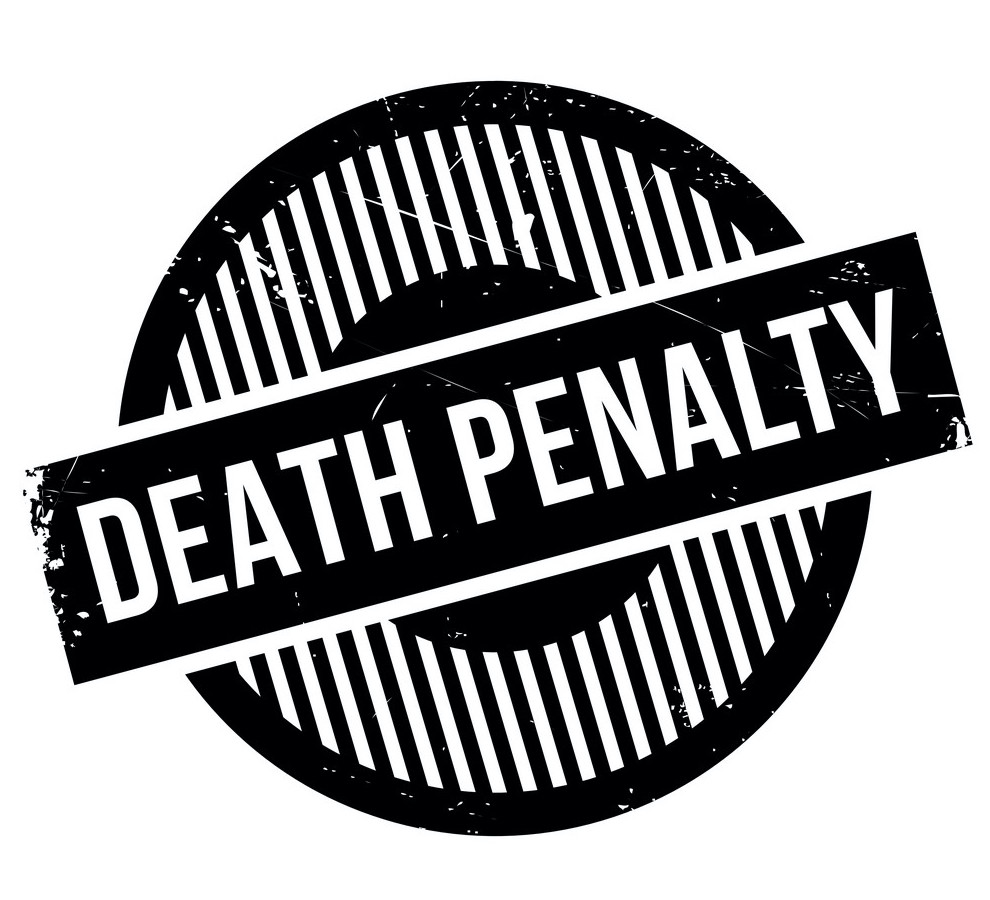

<center>


</center>

```{r, echo=FALSE}
  options(warn=-1)
packages.used=as.list(
  c(
  "tidyverse",
  "haven",
  "devtools",
  "RColorBrewer",
  "data.table",
  "ggplot2",
  "dplyr")
)
```

## Introduction
Death penalty and gun control have always been politicized during election seasons. It would be interesting to shift attention away from the politicians and investigate voters' thoughts. In this project, I want to explore and answer the following questions:

- Over the years, did voters' attitude alter? 

- Is there a connection between voters' party identification and attitude toward these two topics?

- Would being Conservative or Liberal affect voters' attitude toward these two topics?

## Time Trend
To discover the respondents' opinion on death penalty, I analyzed the responses to the survey question "Do you favor or oppose the death penalty for persons convicted 
of murder?" that was added to the ANES survey since 1988. According to the following chart, there are always more votes who favor such punishment for crime than those who oppose it. (The peak in 2012 is due to increased sample size.)

```{r read in data, echo=FALSE,message=FALSE}
  library(haven)
  anes_dat <-
    read_sav("../data/anes_timeseries_cdf.sav")
```
```{r,echo=FALSE,message=FALSE}
  library(ggplot2)
  library(dplyr)
  temp = as.data.frame(table(anes_dat$VCF9236,anes_dat$VCF0004))
  temp <- temp[(temp$Var2 %in% c("1988", "1990", "1992","1994","1996","1998","2000","2004","2006,","2008","2010","2012","2014","2016")),]
  table1 <- temp %>% filter(Var1 == "1")
  table2 <- temp %>% filter(Var1 == "2")
  years = table1$Var2
  freq1 = table1$Freq
  freq2 = table2$Freq
  colors <- c("Favor"="lightblue","Oppose"="lightpink")
  ggplot(table1,aes(x=Var2,group=1))+geom_point(aes(y=freq1),size=1)+geom_line(aes(y=Freq,color="Favor"))+geom_line(aes(y=freq2,color="Oppose"))+geom_point(aes(y=freq2),size=1)+labs(x="Year",y="Freq",color = "Legend",title="Voter's attitude toward Death Penalty")+scale_color_manual(values = colors)
  
```

I analyzed the responses' attitude to gun control from 2000 to 2016. Not many voters want to ease the gun control. There are more votes who favor stricter firearm policy than those who oppose any gun policy changes. The difference, though, is much smaller than in the previous case. This is probably why the gun control remains a controversial issue. 
```{r,echo=FALSE,message=FALSE}
  temp = as.data.frame(table(anes_dat$VCF9238,anes_dat$VCF0004))
  temp <- temp[(temp$Var2 %in% c("2000","2004","2006,","2008","2010","2012","2014","2016")),]
  table1 <- temp %>% filter(Var1 == "1")
  table2 <- temp %>% filter(Var1 == "2")
  table3 <- temp %>% filter(Var1 == "3")
  years = table1$Var2
  freq1 = table1$Freq
  freq2 = table2$Freq
  freq3 = table3$Freq
  colors <- c("More difficult"="lightblue","Keep these rules about the same"="lightpink","Make it easier"="orange")
  ggplot(table1,aes(x=Var2,group=1))+geom_point(aes(y=freq1),size=1)+geom_line(aes(y=Freq,color="More difficult"))+geom_line(aes(y=freq2,color="Keep these rules about the same"))+geom_point(aes(y=freq2),size=1)+geom_line(aes(y=freq3,color="Make it easier"))+geom_point(aes(y=freq3),size=1)+labs(x="Year",y="Freq",color = "Legend",title="Voter's attitude toward Gun Control")+scale_color_manual(values = colors)
```

## Party Identifications

Would the party identification of a voter affect his opinion? In the chart below, more voters support death penalty than against it disregarding of the party identification. A strong majority of Republicans support the death penalty while over one third of Democrats oppose it. In other words, Democrats are more likely to oppose death penalty than Republicans do and Republicans are more likely to support it than Democrats do. 

```{r,echo=FALSE,message=FALSE}
  counts = table(anes_dat$VCF9236,anes_dat$VCF0302)
  barplot(counts, main="Party Identification VS Death Penalty Attitude",
  xlab="Party Identification",ylab = "Death Penalty Attitude", col=c("lightblue","lightpink"), legend=c("Favor","Oppose"),beside=TRUE,names.arg = c("Republican","Independent","No preference","Other","Democrat"),args.legend = list(x="top"))
```

When it comes to gun control issue, different parties have variate thoughts. The majority of Republicans want to keep the gun policy as it is. The amount of Independent(no preference and other also) voters who want to keep the rules the same is roughly the same to that of those who want to make the rule stricter. A strong majority of Democrats prefer making the gun control more difficult. In all parties, a minority of votes likes to ease the gun policies.

```{r,echo=FALSE,message=FALSE}
  counts = table(anes_dat$VCF9238,anes_dat$VCF0302)
  barplot(counts, main="Party Identification VS Gun Control Attitude",
  xlab="Party Identification",ylab = "Gun Control Attitude", col=c("lightblue","lightpink","orange"), legend=c("More difficult","Keep these rules about the same","Make it easier"),beside=TRUE,names.arg = c("Republican","Independent","No preference","Other","Democrat"),args.legend = list(x="top"))
```

## Conservative or Liberal
For the last part, let's see whether being liberal or conservative would affect voters' attitude. No matter the voters are Liberal, Moderate or Conservative, the majority prefer favoring the death penalty. Liberal voters are more likely to oppose the death penalty than others. On the other hand, Conservative are least likely to oppose death penalty.

```{r,echo=FALSE,message=FALSE}
    counts = table(anes_dat$VCF9236,anes_dat$VCF0804)
  barplot(counts, main="Death Penalty",
  xlab="Conservative or Liberal",ylab = "Death Penalty Attitude", col=c("lightblue","lightpink"), legend=c("Favor","Oppose"),names.arg = c("Liberal","Moderate","Conservative","DK"),args.legend = list(x="topright"))
```

In the case of gun control, Conservatives tend to keep the gun policy the same while the Liberals tend to tighten the gun policy. In other words, Conservatives and Liberals are take different sides on the gun control issue. Regardless of being Liberal or whatsoever, not many voters like to loosen the gun policy. 


```{r,echo=FALSE,message=FALSE}
  counts = table(anes_dat$VCF9238,anes_dat$VCF0804)
  barplot(counts, main="Gun Control",
  xlab="Conservative or Liberal",ylab = "Gun Control Attitude", col=c("lightblue","lightpink","orange"),names.arg = c("Liberal","Moderate","Conservative","DK"),args.legend = list(x="topright"))
  legend("topright",legend=c("More difficult","Keep these rules about the same","Make it easier"),fill = c("lightblue","lightpink","orange","lightgrey"), cex=0.55)
```

## Summary
In this project, I explored two social issues, death penalty and gun control, from three different aspects. Based on the analysis above, I have found some patterns and am ready to answer the questions.

- Voters' attitudes toward both death penalty and fun control did not alter much since the trend lines in both charts never cross. However, the surveys participants differ in every survey years so that I cannot conclude whether individuals ever change their opinions. But in the big picture, there are always more voters who favor than oppose in the death penalty case, and more voters who like to make gun control more difficult than those who want to keep the rules the same in the gun control case.

- In the death penalty case, the majority of voters who oppose the death penalty tend to be Democrats, and the minority of that are likely Republicans. In the gun control case, Democrats are more likely to prefer stricter gun policy than any other parties and Republicans are more likely to keep the gun policy about the same.

- In the death penalty case, Liberals are more open to death penalty than Conservatives do. In the gun control case, Liberals are more on the stricter gun rules side while Conservatives are more on the keep the rules the same side.

